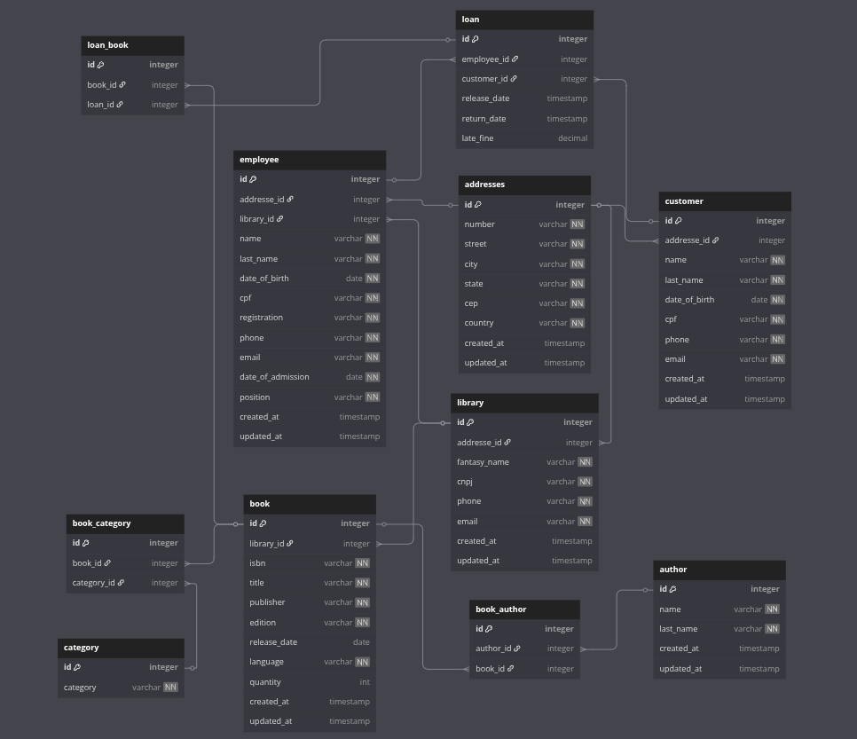

# Biblioteca
A proposta é um sistema de biblioteca simples de gerenciamento de livros, autores, empréstimos, usuários e funcionarios explorando desde a modelagem de dados, normalização, relacionamentos entre tabelas, até a criação de queries SQL eficientes utilizando PostgreSQL.

# Modelagem do Banco

